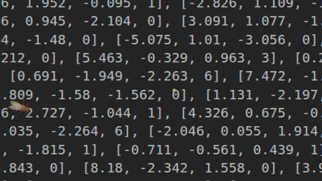
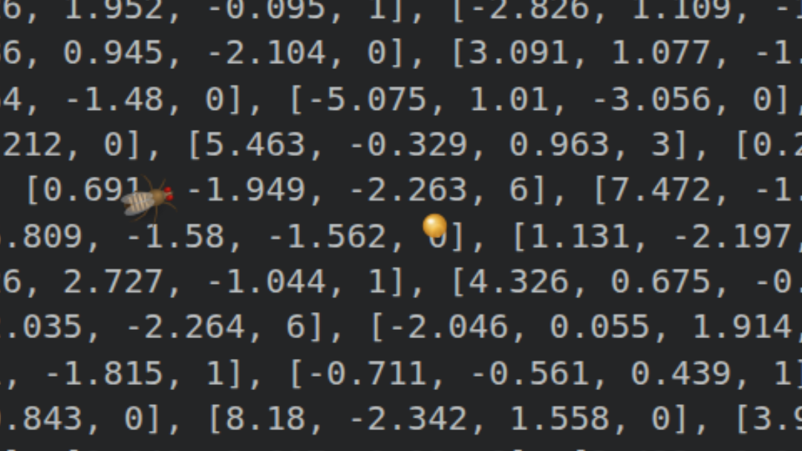

# desktopfly (Linux) 🪰

A 3D fruit fly that lives on your Linux desktop — walking, grooming, sleeping and
fleeing your cursor because a **live spiking simulation of the real FlyWire
connectome** says so, not because an animation was triggered.



*Ctrl+right-click leaves sugar; the odour steers the real DNa01/DNa02 and DNp09
neurons and the fly walks over to feed. It is standing on the very neuron
coordinates that drive it — `data/brain_points.json`.*



This is a Linux port of [DenisSergeevitch/desktop-fly](https://github.com/DenisSergeevitch/desktop-fly),
which is macOS-only (Cocoa + SceneKit). The original is kept verbatim in
[`upstream/`](upstream/) as the reference; see [docs/PORT_PLAN.md](docs/PORT_PLAN.md)
for what was translated, what was rewritten, and what Wayland makes impossible.

## What's real

Unchanged from upstream — the port uses the same derived data files:

- **23,210 real neuron soma positions** (of 139,255 in FlyWire v783) render the
  rotating brain window, coloured by super-class.
- **A 668-neuron circuit with 18,968 real synaptic connections** (signed by
  neurotransmitter prediction) runs as a 1 kHz leaky-integrate-and-fire sim:
  LC4 (104) + LPLC2 (210) looming detectors, DNp01/Giant Fiber (2), DNa01+DNa02
  steering (4), DNp09 walking (2), DNg11 grooming (6), MDN backward (4),
  DNp02/04/11 escape-wing (6), plus their 330 strongest partners.
- **Escape is not scripted.** Your cursor's approach becomes looming input to the
  real LC4/LPLC2 cells, and the fly takes off only when the Giant Fiber actually
  spikes through its real synapses. In this port's `--simtest`, an abrupt loom
  produces the first GF spike at **4 ms** — the same latency upstream documents,
  and the same order as the real animal.

The body is procedural: FlyWire is a *brain* connectome, so no body geometry
exists to port.

## Requirements

Ubuntu 24.04 / GNOME 46 on X11 or Wayland (XWayland). Everything needed ships
with Ubuntu:

```sh
sudo apt install python3-numpy python3-cairo python3-xlib python3-gi \
                 gir1.2-ayatanaappindicator3-0.1
```

No `python3-gi-cairo` needed — the renderer deliberately avoids the GI/cairo
bridge (see [docs/PORT_PLAN.md](docs/PORT_PLAN.md#rendering)).

## Run

```sh
./run.sh                    # fly + brain window, on the primary monitor
./run.sh --monitor 1        # pick a monitor (--list-monitors to see them)
./run.sh --no-brain         # fly only
```

A 🪰 appears in the tray; quit from there, or Ctrl-C the terminal.

> **Running from a VS Code / Claude Code terminal?** Use `./run.sh`, not
> `python3 -m desktopfly`. The VS Code snap exports `GTK_PATH` and friends
> pointing at its own bundled GTK, which makes system PyGObject fail on import.
> `run.sh` goes through `tools/desnap.sh`, which scrubs those.

## Controls (tray 🪰)

| item | effect |
|---|---|
| Pause / Resume | freeze the world |
| Show/Hide Brain | toggle the live brain window |
| Escape Test (loom) | inject a looming stimulus, watch the GF fire |
| Move to Next Display | hop the fly across monitors (multi-monitor only) |
| Leave Sugar at Cursor | drop sugar where the pointer is |
| Clear Sugar | remove every drop (or click a drop to wipe just that one) |
| Add / Remove Fly | extra flies (only fly #1 carries the brain) |
| Scare Flies | startle everyone |

## Sugar

**Ctrl + right-click anywhere** leaves a drop of sugar on the screen (or use the
tray menu). **Click a drop to wipe it up.** Only the bead itself is clickable —
a click a few pixels away passes straight through to whatever is underneath, so
drops never get in your way. The fly smells it, walks over, extends its proboscis and feeds until
it is full; then it grooms, as flies do after a meal, and ignores sugar for a few
minutes while it is sated. Escape always outranks a meal — startle it mid-feed
and it takes off.

```sh
./run.sh --sugar-modifier super   # or shift / alt / none
```

Ctrl+right-click is taken by a passive X **button grab**, so it does not also
reach the app underneath — no stray context menu. Plain right-click is
completely unaffected; only that one combination is grabbed.

Two caveats. `--sugar-modifier none` cannot use a grab (it would swallow every
right-click on the system), so it falls back to watching raw input, where the
modifier check is unreliable. And like every other window-related sense here,
the grab only covers **X11/XWayland** surfaces — Ctrl+right-click over a native
Wayland window (the GNOME desktop background, for instance) will not register.
The tray's *Leave Sugar at Cursor* always works.

### What's real about it

Approach is real; taste is not. Specifically:

- **Real**: the odour bearing is injected as current onto the actual
  **DNa01/DNa02** steering neurons and the actual **DNp09** walking command
  neuron. The turn and the gait that follow are produced by the real network
  through real synapses — the same way upstream's cursor→looming pathway works.
- **Modeled**: the odour field, its falloff, and the decision to start feeding
  on contact.

That split is forced, and it was checked rather than assumed. The 668-neuron
circuit is an escape/steering/locomotion circuit; its 16 `sensory` partners are
**all mechanosensory** (the wind/Johnston's-Organ pathway that feeds the giant
fiber). FlyWire v783 *does* contain **334 gustatory neurons**, but scanning all
3.87 M connection rows shows they make **zero synapses onto any of the 668
circuit neurons** — they project into SEZ feeding circuitry instead. A genuine
sugar pathway would mean extracting a second circuit, not extending this one.

**The brain window is interactive**: hovering pauses the rotation; clicking a
region stimulates the ~60 nearest circuit neurons for 400 ms. The fly's reaction
is whatever the real network does downstream — click the Giant Fiber and it
escapes, click DNg11 and it grooms.

## Diagnostics

```sh
./run.sh --simtest          # circuit invariants: GF silent at rest, 4 ms loom latency, ...
./run.sh --behaviortest     # 17 end-to-end checks: stimulate neurons -> body reacts
./run.sh --snapshot f.png   # offscreen fly render
./run.sh --brainshot b.png  # offscreen brain render
```

Both suites are ported check-for-check from upstream and both pass. They are
seeded by default so a red result means a real regression — upstream runs them
unseeded, where three checks are genuinely flaky. See [docs/PARITY.md](docs/PARITY.md).

## Desktop ecology on Linux

| sense | macOS | here |
|---|---|---|
| window terrain / looms | `CGWindowListCopyWindowInfo` | EWMH `_NET_CLIENT_LIST` |
| user idle, sleep | `CGEventSource` | `org.gnome.Mutter.IdleMonitor` |
| typing as vibration | keyDown-only idle query | idle reset without pointer motion |
| clicks as substrate taps | global event monitor | XInput2 raw button events |
| temperature | `ProcessInfo.thermalState` | `/sys/class/thermal` |

Circadian rhythm, sleep, grooming-after-waking and thermal tempo all work as
upstream. **Native Wayland windows are invisible** to the terrain and tap senses
— no unprivileged Wayland client can enumerate other windows or observe their
input. X11/XWayland apps work fully. Details and options in
[docs/PORT_PLAN.md](docs/PORT_PLAN.md#known-limitations).

## Licence

Port and original code are **MIT** — see [`LICENSE`](LICENSE). The files in
`data/` are *not*: they are derived from FlyWire (FAFB v783) and are
**CC BY-NC 4.0**, so the repository as a whole is non-commercial. See
[`DATA_LICENSE.md`](DATA_LICENSE.md). If you use this, cite:

- Dorkenwald, S. et al. *Neuronal wiring diagram of an adult brain.* Nature 634, 124–138 (2024).
- Schlegel, P. et al. *Whole-brain annotation and multi-connectome cell typing of Drosophila.* Nature 634, 139–152 (2024).
